# My Ecommerce Project Using Django

`This is a custom ecommerce website built using Django.
The platform allows users to browse products, add them to cart, and place orders through a smooth checkout process.
It also includes an admin panel for managing products and orders.`

## 🚀 Features
- User Registration & Login System  
- Product Listing (Shop Page)  
- Product Detail View  
- Category-wise Product Display  
- Add to Cart Functionality  
- Cart Management (Update Quantity / Remove Items)  
- Checkout & Billing Address System  
- Order Placement Functionality  
- Dynamic Product Rendering using Django Templates  
- Responsive User Interface (Mobile Friendly)  
- Django Admin Panel for Product & Order Management  
- Secure Backend using Django Framework
- Order Tracking
- Online Payment
- This project follows the MVC (Model-View-Template) architecture of Django, ensuring separation of concerns and scalability.
  

📸 FINAL Figure STRUCTURE

🔷 🔹 SECTION 1: User Interface (Frontend)

📌 Figure 1: Home Page
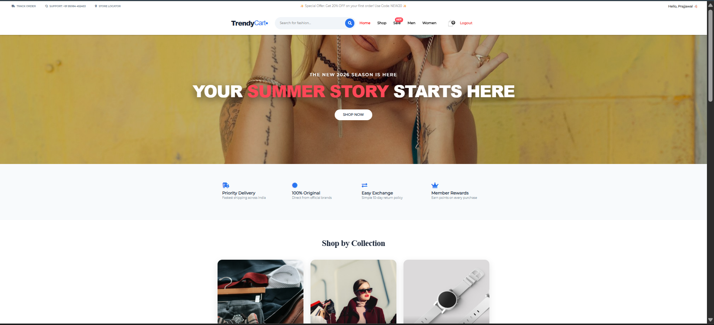

📌 Figure 2: Shop Page


📌 Figure 3: About Page
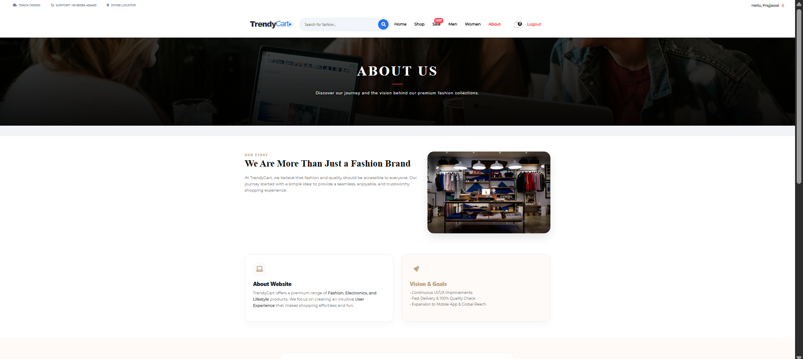

📌 Figure 4: Products Detail Page
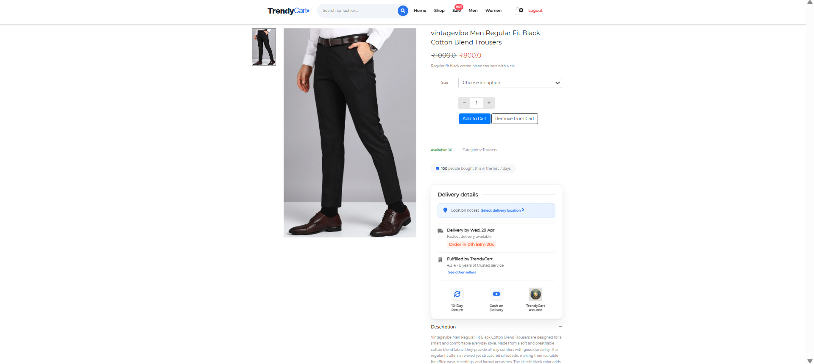

📌 Figure 5: Product Category Page


📌 Figure 6: Filtered Product Display


📌 Figure 7: Products With discount
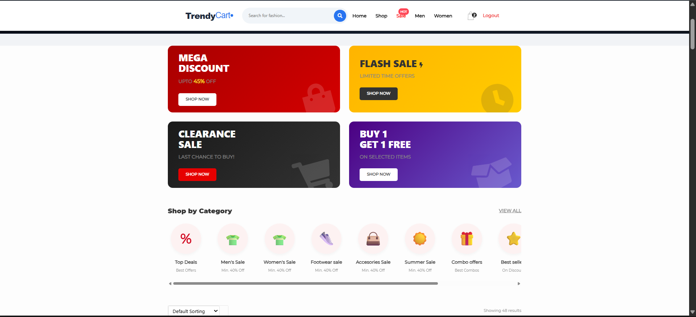

📌 Figure 8: Product Search Result
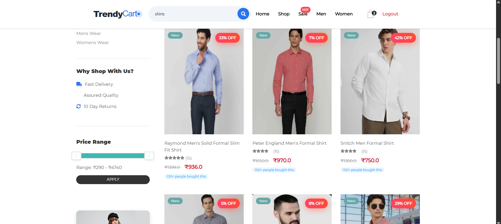

🔷 🔹 SECTION 2: Shopping Flow

📌 Figure 9: Shopping Cart Page
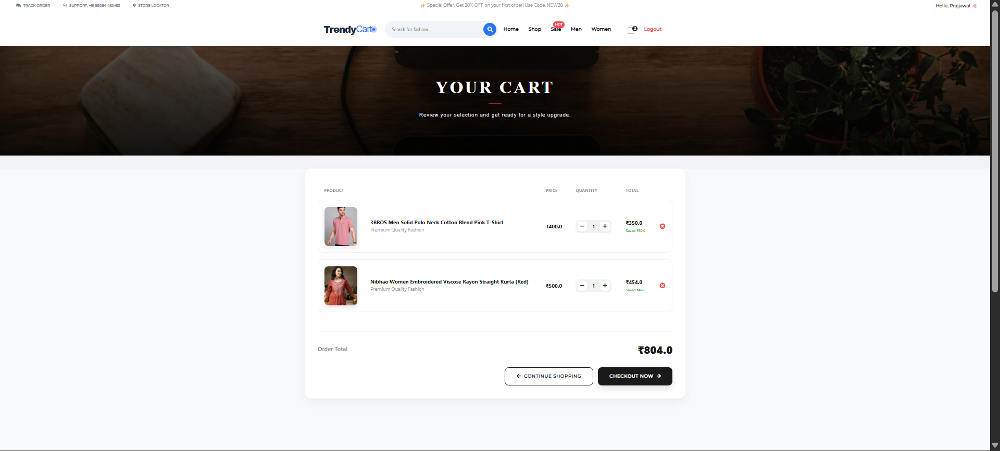

📌 Figure 10: Checkout & Billing Address Page
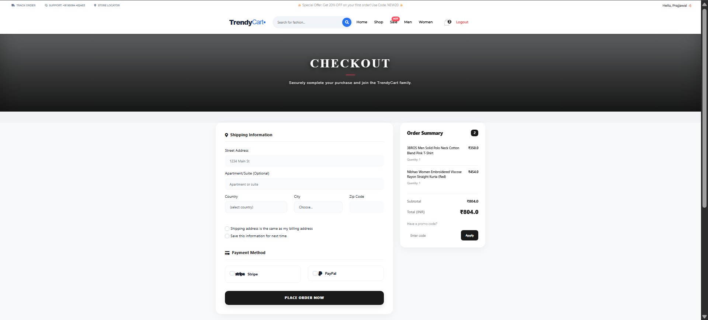

🔷 🔹 SECTION 3: User Authentication

📌 Figure 11: User Login Page
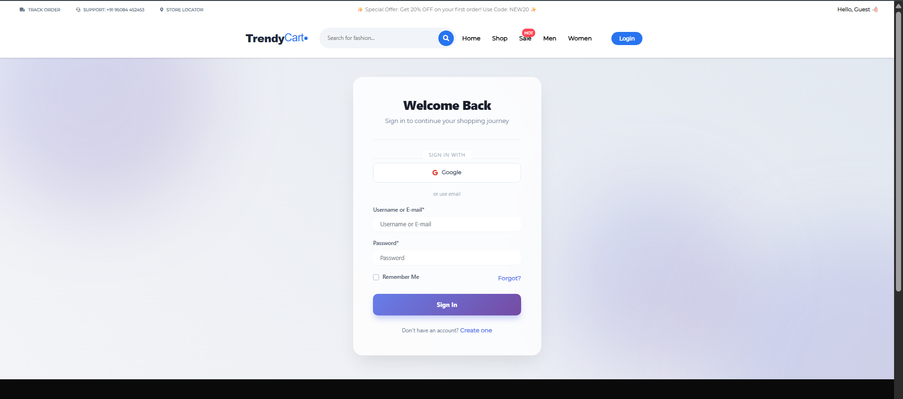

📌 Figure 12: User Registration Page
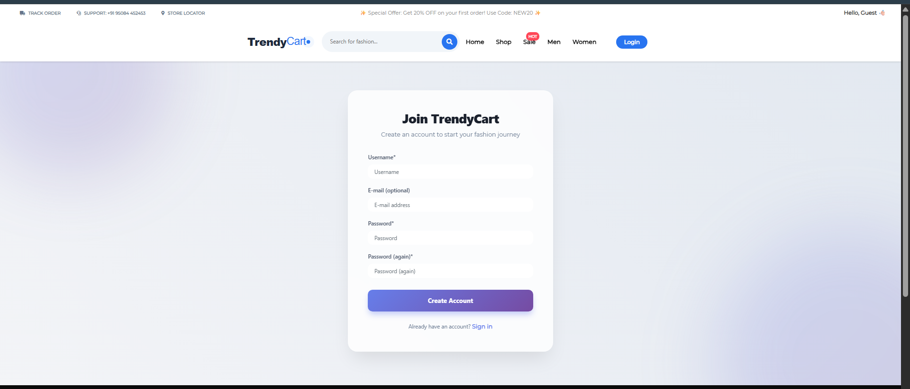

🔷 🔹 SECTION 4: Admin & Backend

📌 Figure 13: Django Admin Panel
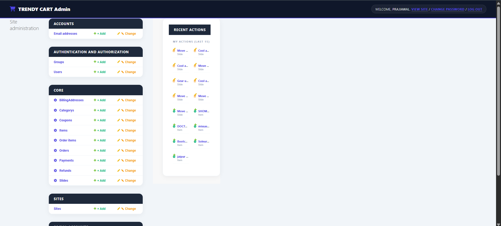

📌 Figure 14: Product Management {Admin Panel}
.png)

📌 Figure 15: Databse Data View
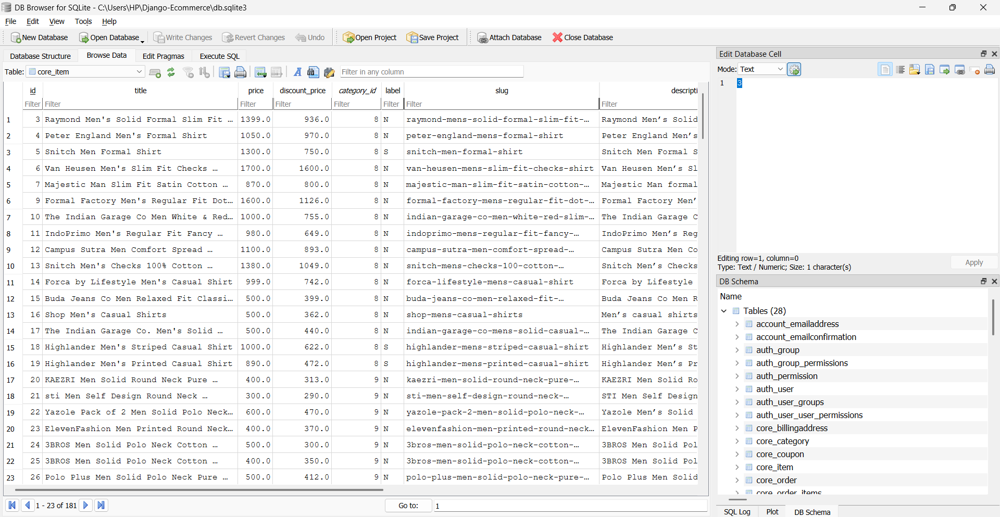

🔷 🔹 SECTION 5: Extra UI Feature

📌 Figure 16: Website Rating
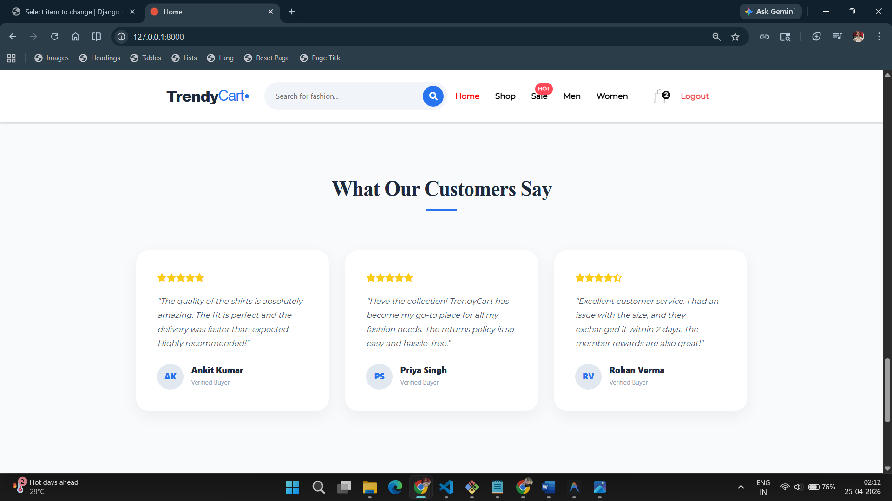

📌 Figure 17: Product Rating
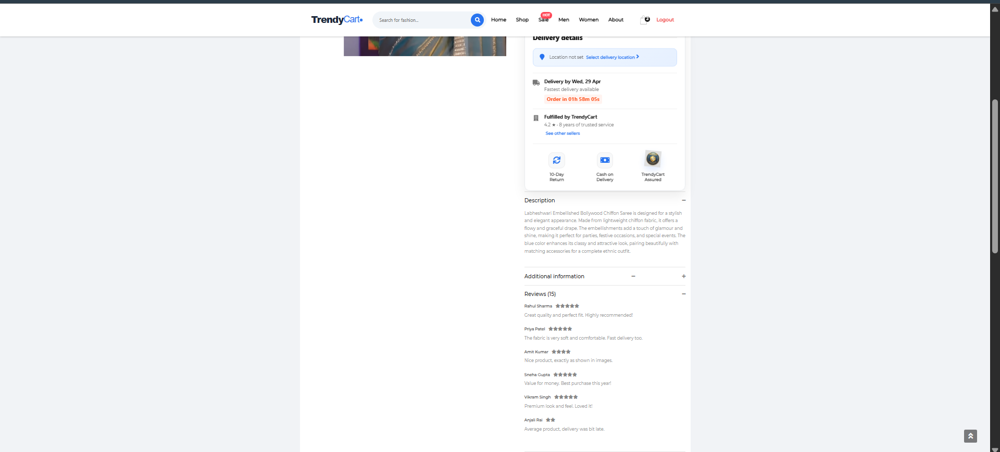

📌 Figure 18: Website Footer
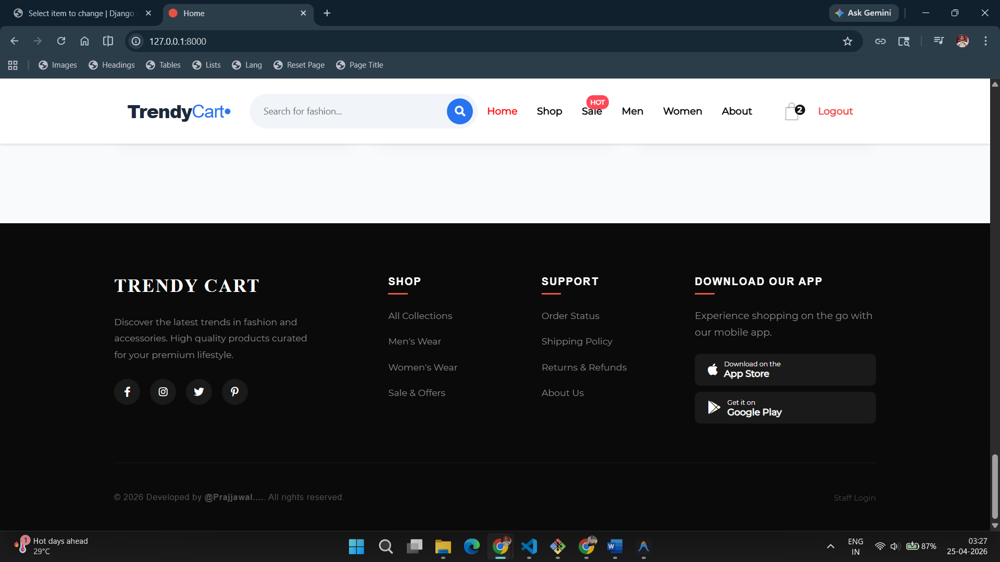

📌 Figure 19: Navigation Bar
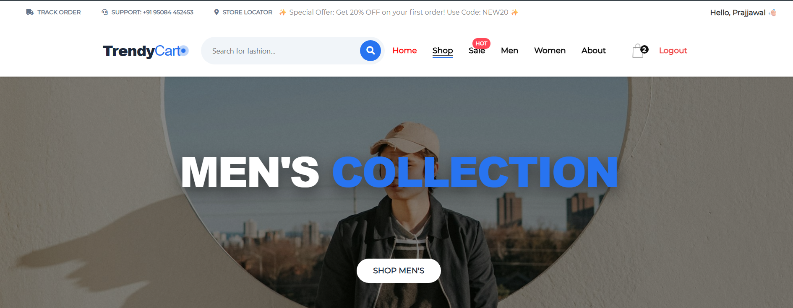


# Installation

`git clone https://github.com/zinmyoswe/Django-Ecommerce.git`

`cd Django-Ecommerce`

`pip install virtualenv`

`virtualenv env`

# For Mac/ Linux

`source env/bin/activate`

# For Window

`env\Scripts\activate`

`pip install -r requirements.txt`

Install below version in terminal and 'New Version will face version conflict error'

```python

pip install Django==2.2.4
python -m pip install django-allauth==0.40.0
pip install django-crispy-forms==1.7.2
pip install django-countries==5.5
pip install stripe==2.37.1
pip install Pillow

```

`python manage.py makemigrations`

`python manage.py migrate`

`python manage.py runserver`

# For Admin Login

```python
python manage.py createsuperuser
Username : admin
Password : 12345678
```
# Demo

http://djangoecommerce.pythonanywhere.com

# HTML Template

https://colorlib.com/etc/fashe/index.html


